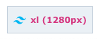

# Tailwind CSS Plugin Breakpoint Inspector

[Tailwind CSS](https://tailwindcss.com) plugin for adding breakpoint inspector for development purposes. It will show
you
the current breakpoint in the bottom right corner of your screen and will update as you resize your browser window.



## Installation

```bash
# Install using NPM
npm install @maxserv/tailwindcss-breakpoint-inspector --save-dev

# Install using Yarn
yarn add @maxserv/tailwindcss-breakpoint-inspector --dev

# Install using Bun
bun install @maxserv/tailwindcss-breakpoint-inspector --dev
```

## Usage

Add the plugin to your `tailwind.config.js` file:

```javascript
module.exports = {
    plugins: [
        require('@maxserv/tailwindcss-breakpoint-inspector')
    ]
}
```

Use the `NODE_ENV` variable to set the environment to `production` or use the `--build` flag to prevent it from being
displayed on production builds.

## Created by

[MaxServ](https://www.maxserv.com) - Digital Mastery
